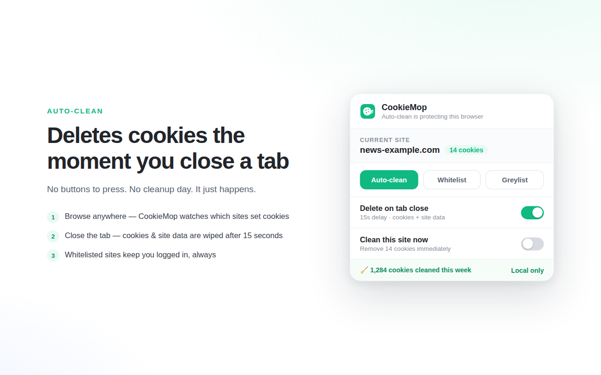
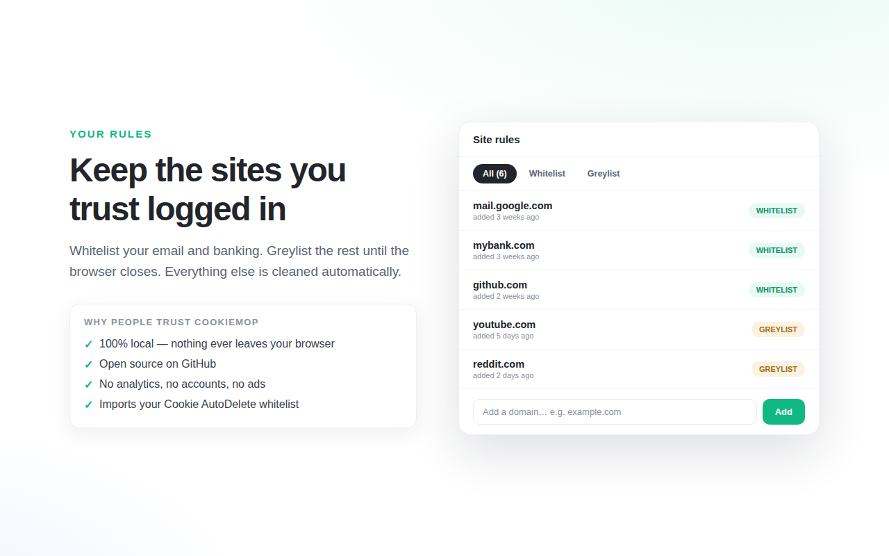

# CookieMop 🍪🧹

**Auto delete cookies & site data the moment you close a tab.** Keep only the sites you trust.

CookieMop is a Manifest V3 successor to Cookie AutoDelete: when you close a tab, the cookies (and optionally localStorage, IndexedDB, CacheStorage and Service Workers) of the sites you visited there are automatically deleted — unless the site is on your whitelist.

## Why people trust CookieMop

- ✅ **100% local** — nothing ever leaves your browser. No servers, no requests.
- ✅ **Open source** — this repository is the exact code that ships to the Chrome Web Store.
- ✅ **No analytics, no accounts, no ads** — zero tracking of any kind.
- ✅ **No remote code** — plain JavaScript, no build step, no dependencies.
- ✅ **Imports your Cookie AutoDelete whitelist** in one click.

## Features

- **Auto-clean on tab close** — cookies for a site are deleted after you close its last tab, with a configurable delay (default 15 s) as a safety net for accidentally closed tabs.
- **Whitelist** — sites that are never cleaned (stay logged in, always).
- **Greylist** — sites cleaned only when the browser closes.
- **Cleanup scope** — cookies only (default), + localStorage, or + all site data (IndexedDB, CacheStorage, Service Workers).
- **Badge counter** — see how many cookies the current site has set, right on the toolbar icon.
- **Manual cleaning** — "Clean this site now" and "Clean all except open tabs".
- **Statistics** — cookies cleaned today and in total (stored locally).
- **Cookie AutoDelete import** — bring your whitelist/greylist over from the original extension's JSON export.
- **English & Korean** UI.

## How it works

1. **Browse anywhere** — CookieMop watches which sites each tab visits.
2. **Close the tab** — after a short delay, if no other open tab uses that site, its cookies & site data are wiped.
3. **Whitelisted sites keep you logged in, always.**

## Install

- Chrome Web Store: *coming soon*
- From source: clone this repo, open `chrome://extensions`, enable **Developer mode**, click **Load unpacked**, and select the repo folder.

## Permissions, explained

| Permission | Why it's needed |
|---|---|
| `cookies` | Deleting cookies is the whole point |
| `tabs` | Detecting tab closes and which site a tab is on |
| `browsingData` | Optional deletion of localStorage / IndexedDB / caches |
| `storage` | Saving your settings and rules (locally / Chrome sync) |
| `alarms` | Firing the delayed cleanup reliably in Manifest V3 |
| Host access (`<all_urls>`) | A cookie manager must be able to touch any site's cookies |

## Known limitations

- **Partitioned (CHIPS) cookies are not deleted.** Cookies that third-party embeds set with the `Partitioned` attribute cannot be enumerated per top-level site through the extension cookies API, so CookieMop leaves them alone for now. Chrome already isolates them per site, which sharply limits their tracking value.
- **Greylist timing.** "Cleaned when the browser closes" is implemented as clean-on-next-startup — the only reliable hook Manifest V3 offers. This pass also runs when the extension itself is reloaded or updated.

## Privacy

CookieMop makes **zero network requests**. It has no backend, collects nothing, and stores your settings only in Chrome's own extension storage. See for yourself — the code is all here.

Full privacy policy: https://thoopring.github.io/cookiemop/privacy.html

## License

[MIT](LICENSE)
